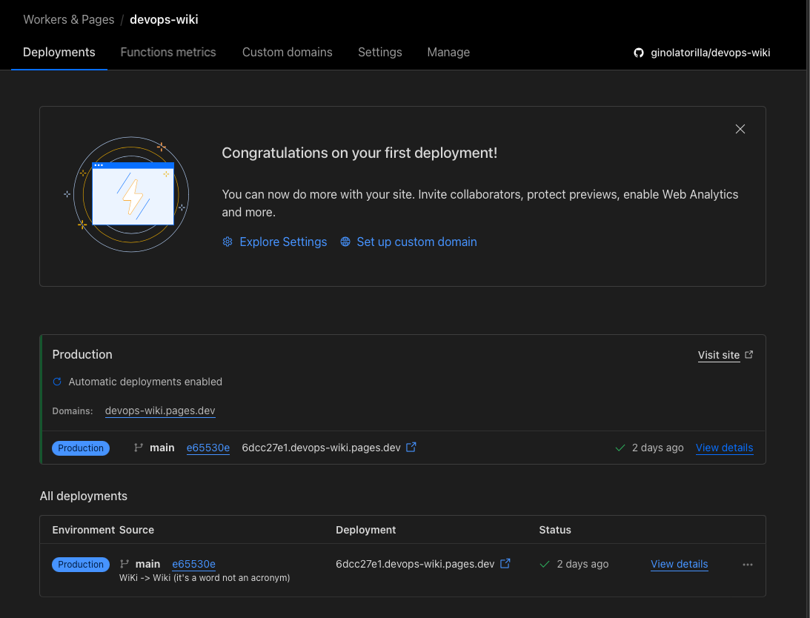

You can use [CloudFlare](https://cloudflare.com) to host a website for free.
Their free plan lets you use the **pages.dev** domain, which is compact and disassociated with commercial brands
compared to **github.io** or **gitlab.io**. The plan will not bill you for any traffic with your static website.

CloudFlare can pull your website from either GitHub or GitLab.
You can use plain HTML or a [supported framework](https://developers.cloudflare.com/pages/framework-guides/) in your repository.
This website runs in CloudFlare, uses [Jekyll](https://jekyllrb.com) with minimal customisations.
You can view the source code [here](https://github.com/ginolatorilla/devops-wiki).

## Procedure

1. Prepare your website files and push them to either GitHub or GitLab.
2. Log in or sign up to CloudFlare.
3. When your dashboard loads, select **Workers & Pages** in the left navigation pane.
4. Click the **Create application** button.
5. Click the **Pages** tab.
6. Click the **Connect to Git** button.
7. Follow the instructions to configure how to build your website, which Git branch to use, etc.

For example, here's the CloudFlare Pages project of this website on its first deployment.

## References

- <https://developers.cloudflare.com/pages/>
