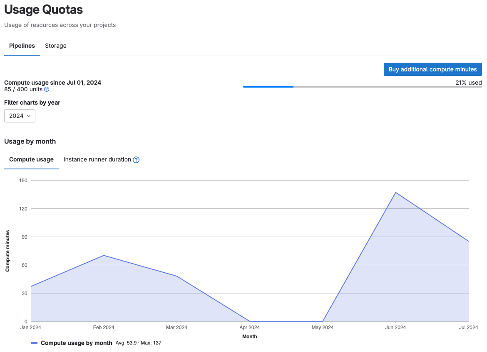
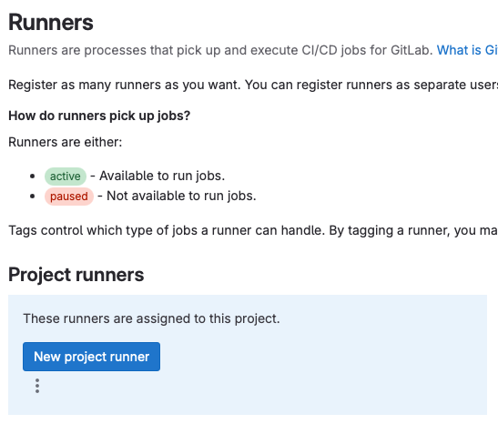
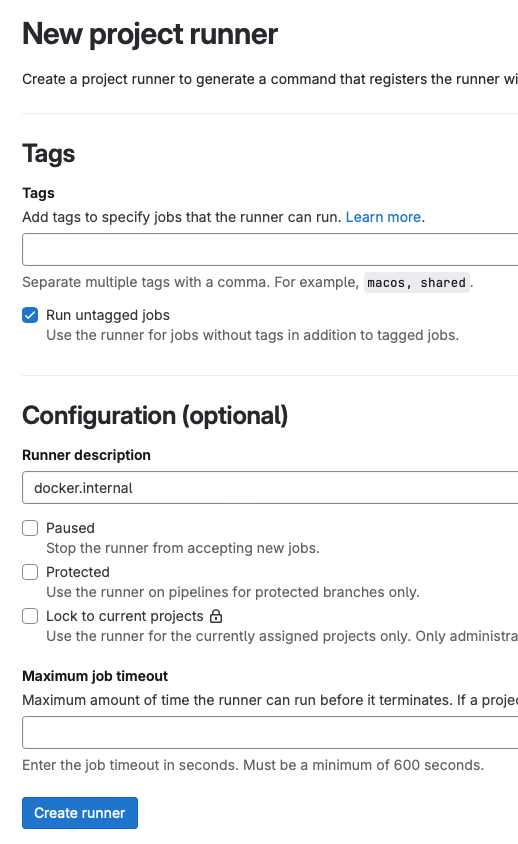
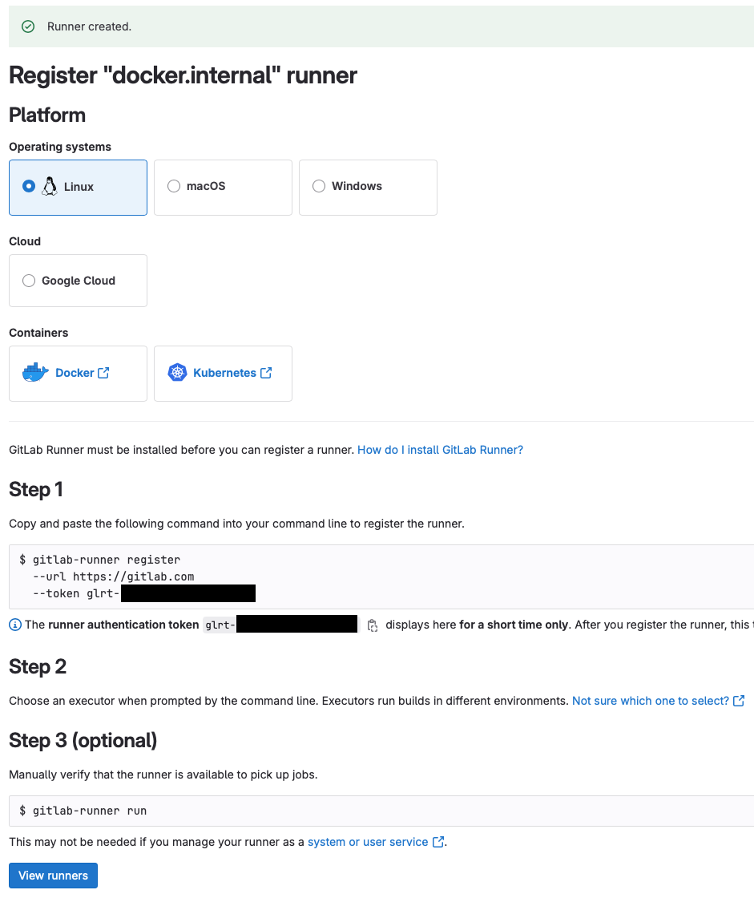
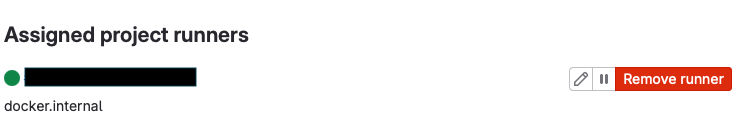
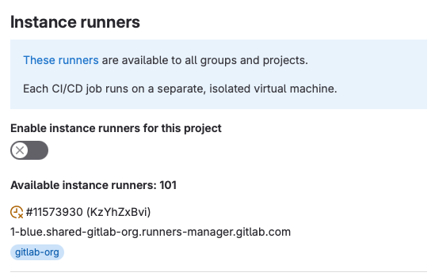
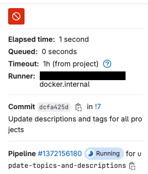

There is a [limit](https://docs.gitlab.com/ee/ci/pipelines/compute_minutes.html)
on how often you can use GitLab-hosted runners in [GitLab](https://gitlab.com/).
For example, they'll give you 400 minutes of free "compute" for their runners. If you exceed these, they will not
pick up your pipeline jobs, getting stuck in a _pending_ state. You have two choices to continue: pay for additional
compute units to GitLab or host your runners.



## GitLab runner

You'll read a lot about runners and executors in GitLab's documentation, but rarely you'll encounter an executor
referenced in the UI.  Be familiar with these concepts first before you install and configure a runner.

- A **runner** is an app that talks to a GitLab instance, taking pipeline jobs to run.
- An **executor** is an environment where a pipeline's job scripts will run. When a runner picks up a job, it will
  launch an executor.

For example, you can have executors with Docker to run jobs in isolation or a shell executor that runs directly in the
same context as the runner (dangerous).

## Install a runner

You will host both the runner and its executors in Docker. There are other [ways](https://docs.gitlab.com/runner/install/index.html#binaries)
you can install runners---using Docker is the easiest.

Follow these [instructions](https://docs.gitlab.com/runner/install/docker.html) to install the runner.
Use _Option 1_ so we can configure the runner outside the container.

```shell
docker run -d --name gitlab-runner --restart always \
    -v $HOME/.config/gitlab-runner:/etc/gitlab-runner \
    -v /var/run/docker.sock:/var/run/docker.sock \
    gitlab/gitlab-runner:latest
```

## Register the runner

Once the runner is up, you must register it to GitLab to start taking jobs.
Follow these [instructions](https://docs.gitlab.com/runner/register/index.html) to register.


**Note:** We will use the runner authentication method, but feel free to use the deprecated registration token
method, especially if you have an older version of GitLab.


Go to **Settings > CI/CD > Runners** page in your GitLab project and press the **New Project Runner** button.



Configure the runner as needed.



The next page will show you the runner authentication token, which you must use to register.



GitLab will show you instructions for the `gitlab-runner` program, but since we launched it in a container, here is
what you need to do:

```shell
$ docker exec -it gitlab-runner gitlab-runner register --url https://gitlab.com --token glrt-***
Runtime platform                                    arch=arm64 os=linux pid=64 revision=9882d9c7 version=17.2.1
Running in system-mode.

Enter the GitLab instance URL (for example, https://gitlab.com/):
[https://gitlab.com]:
Verifying runner... is valid                        runner=***
Enter a name for the runner. This is stored only in the local config.toml file:
[***]: docker.internal
Enter an executor: ssh, virtualbox, docker-windows, docker+machine, instance, custom, shell, parallels, docker, kubernetes, docker-autoscaler:
docker
Enter the default Docker image (for example, ruby:2.7):
busybox:stable
Runner registered successfully. Feel free to start it, but if it's running already the config should be automatically reloaded!

Configuration (with the authentication token) was saved in "/etc/gitlab-runner/config.toml"
```

You should see the runner on GitLab's settings page.



## Using the runner

Since we allowed the runner to run untagged jobs in the example, it should be able to pick up jobs in the project's
pipeline. You can disable instance runners to ensure your runners will only pick up the jobs.



Here's an example of a GitLab pipeline job executed by our runner:


